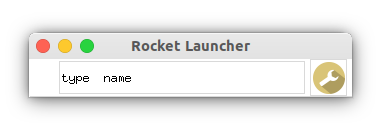
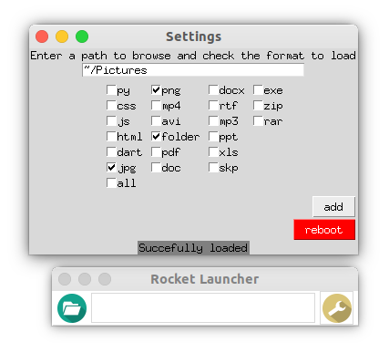
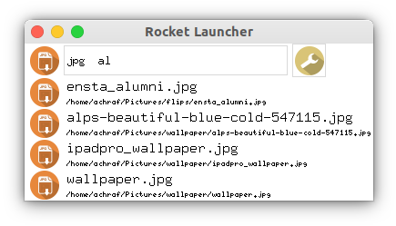
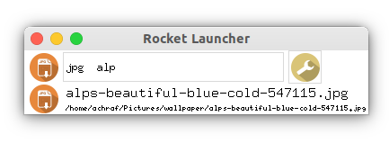
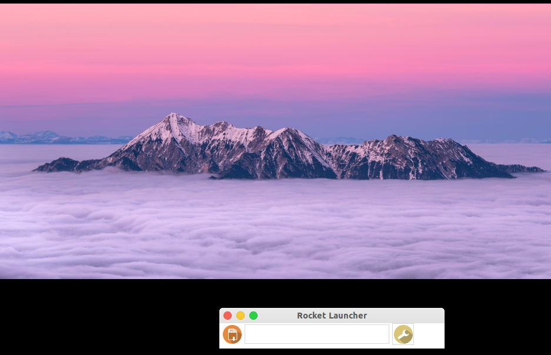

## Why this project ?

I was running on Windows and the search bar is not really working.
I wanted a software like Alfred (only for Mac), but never found an alternative for Windows (tried several).
So I tried to build my own version of it.

_Edit: I now use Linux so the repo has 2 branches one that works with Windows command line and another adapted for Linux._

## What did I use ?

- Python3.6 (only language I knew at the time)
- tkinter library to create GUIs.
- sqlite

## How does it works ?

You first inform the paths and file extensions you want to track in the settings window:

You can then search by:

1. entering a keyword
   - google / amazon / youtube
     
     
     
   - file extension: pdf / png / folder...
2. pressing space bar twice (corresponding icon should appear)
3. entering your query
   
4. click on the right recommendation and press enter
   

   

## Install and run

requirements:

- python3
- tkinter
- sqlite

`~$ python3 run.py`
